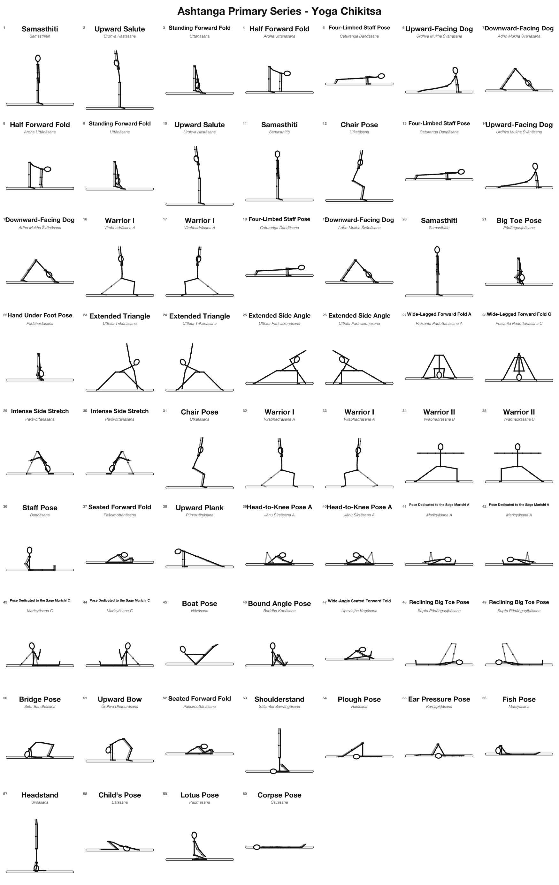
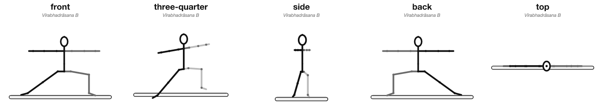
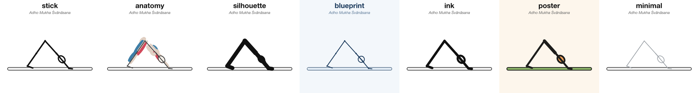
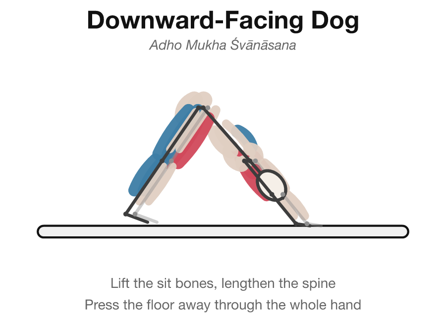
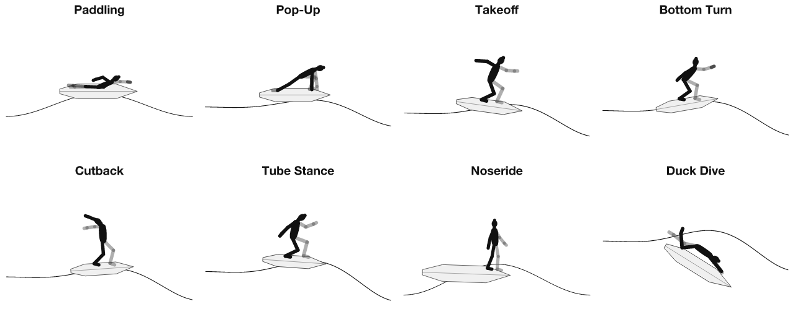

# asanakit

**Programmatic stick-figure and body-posture visualization for yoga and surf, in 2D and 3D.**

Describe a posture as data. Get a correct, deterministic, machine-readable illustration -
from any camera angle - plus an interactive 3D viewer, a GLB model, and physics-correct
positioning when you ask for it.

```bash
npx @franzenzenhofer/asanakit render adho-mukha-svanasana -o downdog.svg --style anatomy --title
npx @franzenzenhofer/asanakit render virabhadrasana-b --camera three-quarter -o warrior.png
npx @franzenzenhofer/asanakit view utthita-trikonasana --open      # orbit it in 3D, offline
npx @franzenzenhofer/asanakit html --all -o library.html --open    # the whole library in ONE page
npx @franzenzenhofer/asanakit gltf navasana -o boat.glb            # a model any 3D viewer opens
npx @franzenzenhofer/asanakit sheet --sequence ashtanga-primary -o primary-series.png --columns 6 --numbered
```

Every pose solves to a real **3D skeleton** (quaternion forward kinematics over a 21-bone
rig). The 2D pictures are camera projections of that solve - front, back, side, any azimuth
and elevation - rendered without a browser or a GPU, byte-identical on every machine. It
ships with a **121-pose library** - the full Ashtanga Primary Series plus standing, seated,
twist, backbend, inversion, arm-balance, core and restorative asanas, and 13 surf
positions - and four bundled sequences.

## asanakit Studio - the online editor

**[asanakit.franzai.com](https://asanakit.franzai.com)** - the whole engine in the browser,
mobile-first. Browse all 121 poses, fork any of them, edit every joint with tap-to-select
bones and degree sliders (with live anatomical lint and an orbitable 3D view), save your own
asanas, and compose practice sheets that print as exact, vector A4/Letter pages. Everything
runs client-side; the editor is `editor/` in this repo (`npm run editor:dev`).



## One pose, any viewpoint

The posture is the data; the viewpoint is just a parameter:



---

## Why it exists

Every other option is a dead end. Traced SVG artwork is unposeable. Pose-estimation
datasets give you keypoints scraped from photos, with no joint angles, no licence you can
use, and no way to say "now bend that knee ten degrees more". 3D mannequin tools are GPL,
or need a GPU, or both.

asanakit takes the third path: a **21-bone 3D kinematic rig** plus a **declarative pose
format**. The posture is the data. Every picture - flat or interactive - is a pure
function of it.

## What you get

- **A pose format** (`.pose.yaml`) with a published JSON Schema. Joint rotations in full
  anatomical vocabulary (`flex`/`extend`, `abduct`/`adduct`, `twist` or
  `internalRotation`/`externalRotation`), absolute bone directions (`azimuth` /
  `elevation`), a default camera, 3D props, annotations, muscle activation, teaching cues.
- **3D forward kinematics** over a 21-bone humanoid rig with anatomical proportions. The
  rotation axes live in the rig as data, so left and right are exact mirrors by construction.
- **Any-angle 2D rendering.** Orthographic camera, depth-sorted painter's algorithm,
  deterministic SVG/PNG with `data-bone` / `data-muscle` / `data-annotation` hooks. No GPU.
- **An interactive 3D viewer.** `asanakit view` writes ONE self-contained offline HTML file
  (three.js inlined): drag to orbit, scroll to zoom, white background.
- **Showcase pages.** `asanakit html` (and `render -o pose.html`) embed EVERYTHING in one
  offline file: the interactive viewer with a pose picker plus a gallery of deterministic
  inline SVG renders - a whole sequence, the whole library, or one pose orbited.
- **GLB / glTF export** via three.js - open the posture in any 3D viewer, rotatable and
  zoomable, muscles colored.
- **Physics when necessary.** `--settle` (or `physics: settle` in the pose) drops the figure
  onto the ground plane with [Rapier](https://rapier.rs) and lets it rest on its true
  support. The authored pose is preserved exactly; only position and orientation change.
- **An anatomical validator.** Knees and elbows that bend backwards are rejected. A pose
  declares which parts of the body touch the floor, and asanakit checks that they do.
- **Left and right, told apart.** Left-side bones render in their own configurable color
  (dark gray by default, `--left-color`/`--right-color` to taste) in 2D and 3D alike -
  driven by the skeleton's bone sides, so a profile finally says which leg is forward.
- **3D props.** The yoga mat (width x length x thickness, yaw) and the surfboard (length,
  width, thickness, pitch) are real, configurable 3D models - correct in the viewer, the
  GLB and every 2D projection.
- **Seven styles**, all pure token data: `stick`, `anatomy`, `silhouette`, `blueprint`,
  `ink`, `poster`, `minimal`.
- **Keypoint export** to MediaPipe-33 and COCO-17 - now with real z.
- **Contact sheets and sequences** - render a whole practice in one command.

## The same posture, seven ways



## Anatomy, not decoration

Muscles are displaced in two anatomical planes - lateral (left/right) and sagittal
(front/back) - and fade between them continuously as the camera orbits, so the chest is
never drawn behind the back. Engaged muscles shade one way, stretched muscles the other.



## Surf



## Install

```bash
npm install -g @franzenzenhofer/asanakit   # the CLI is called `asanakit`
npx @franzenzenhofer/asanakit --help       # or run it without installing
```

The npm registry refuses the bare name `asanakit` (too close to the unrelated
`asynckit`), so the package is scoped. The command it installs is `asanakit`.

## The format

```yaml
asanakit: 2
id: utthita-trikonasana
name: Extended Triangle
sanskrit: Utthita Trikoṇāsana
discipline: yoga
family: standing
breath: exhale
drishti: hastagrai
cues:
  - Reach sideways out of the waist before you tilt down
contact: [toeL, toeR, handTipL]
camera: front                                    # the pose's default viewpoint
figure:
  root:
    roll: -65                                    # the torso cartwheels over the front leg
  world:                                         # absolute directions: azimuth on the body's
    thighL: { azimuth: 90, elevation: -45 }      # compass (0 = forward, 90 = the figure's left),
    thighR: { azimuth: -90, elevation: -45 }     # elevation from horizontal (90 = up)
    spine: { azimuth: 90, elevation: 25 }
    upperArmL: { azimuth: 90, elevation: -80 }
    upperArmR: { azimuth: -90, elevation: 80 }
  joints:                                        # or anatomical rotations relative to the parent
    footL: { abduct: 10 }                        # flex / abduct / twist, in degrees
props:
  - type: mat
muscles:
  engaged: [obliques, quadriceps]
  stretched: [hamstrings, adductors]
```

Full guide: **[docs/AUTHORING.md](docs/AUTHORING.md)**.

## CLI

| Command | What it does |
|---|---|
| `asanakit render <pose> -o out.svg` | render one pose (`.svg` or `.png`) |
| `asanakit render <pose> --camera back` | ...from any preset or `"azimuth=30,elevation=15"` |
| `asanakit view <pose> --open` | interactive 3D viewer: one offline HTML file |
| `asanakit html --sequence ashtanga-primary -o series.html` | ONE self-contained page: 3D viewer with pose picker + SVG gallery |
| `asanakit render <pose> -o pose.html` | single-pose showcase: 3D viewer + the orbit strip |
| `asanakit gltf <pose> -o pose.glb` | export a 3D model (`.glb` or `.gltf`) |
| `asanakit sheet --all -o sheet.png` | contact sheet of many poses |
| `asanakit sequence <id> -o dir/` | every pose of a sequence, in practice order |
| `asanakit lint [poses...]` | check poses against the limits of a real body |
| `asanakit list` | what is in the library |
| `asanakit vocab` | every joint, landmark, muscle, style and camera name |
| `asanakit schema` | the JSON Schema for the pose format |
| `asanakit keypoints <pose>` | export as MediaPipe-33 / COCO-17 keypoints (x, y, z) |
| `asanakit landmarks <pose>` | the solved 3D skeleton, as JSON |

Options: `--camera`, `--settle`, `--style`, `--width`, `--height`, `--title`, `--caption`,
`--muscles`, `--background`, `--optimize`, `--scale`, `--lib <dir>`.

## Library API

```ts
import { parsePose, renderSvg, renderPng, validatePose, solvePose, exportGlb, buildViewerHtml } from '@franzenzenhofer/asanakit';

const pose = parsePose(yamlSource, 'triangle.pose.yaml');

const issues = validatePose(pose);                          // [] means anatomically sound
const svg = renderSvg(pose, { style: 'anatomy', camera: 'three-quarter', title: true });
const png = renderPng(svg, { width: 1200 });

const skeleton = await solvePose(pose, { settle: true });   // physics lives behind this await
const glb = await exportGlb(skeleton);
const html = await buildViewerHtml(skeleton, { title: pose.name, camera: { azimuth: 30, elevation: 15, roll: 0 } });
```

Physics is lazy: importing the package never loads the Rapier WASM; only `solvePose`
with settling (or `import '@franzenzenhofer/asanakit/physics'`) does.

## Built for machines as well as people

- Errors name the field and the file, and report every problem at once.
- `asanakit schema` and `asanakit vocab` are the full contract - a model can discover the
  entire vocabulary without reading the source.
- `asanakit lint` turns "does this look right" into a check that either passes or fails.
- Rendering is deterministic, so output diffs are meaningful in review. (Physics-settled
  output is deterministic per machine: fixed timestep, two runs are identical.)

## Licence

MIT.

Dependencies are all permissive: `three` (MIT), `@dimforge/rapier3d-compat` (Apache-2.0),
`gl-matrix` (MIT), `d3-shape`/`d3-path` (ISC), `xmlbuilder2` (MIT), `commander` (MIT),
`zod` (MIT), `yaml` (ISC), `svgo` (MIT), `@resvg/resvg-js` (MPL-2.0, used unmodified as a
dependency).

The MediaPipe-33 and COCO-17 keypoint layouts restate the public layouts published by the
Apache-2.0 licensed MediaPipe and tfjs-models projects.
